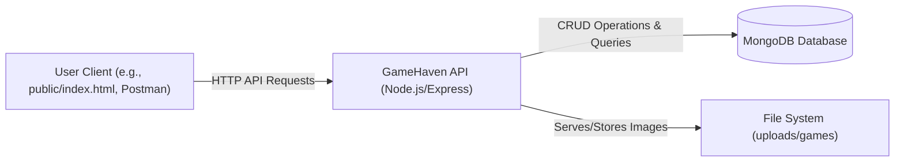
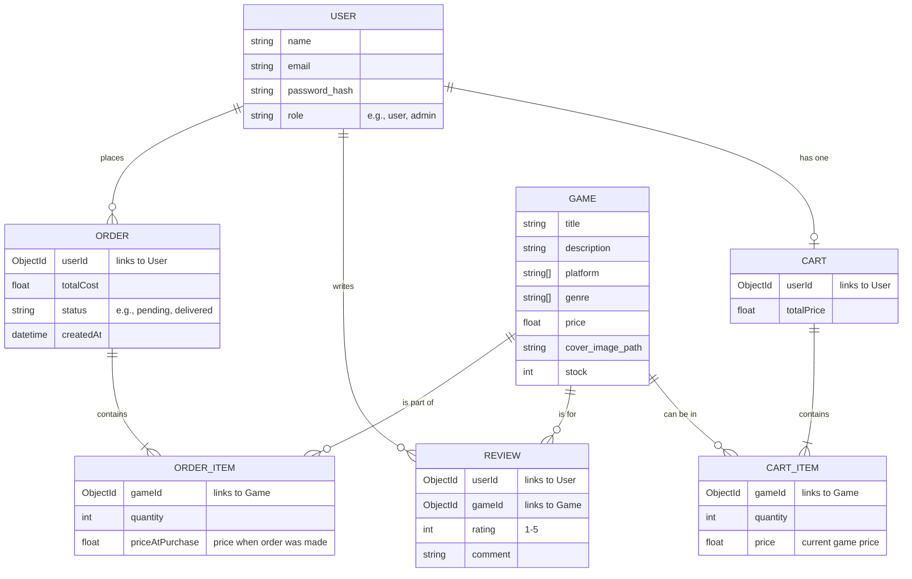
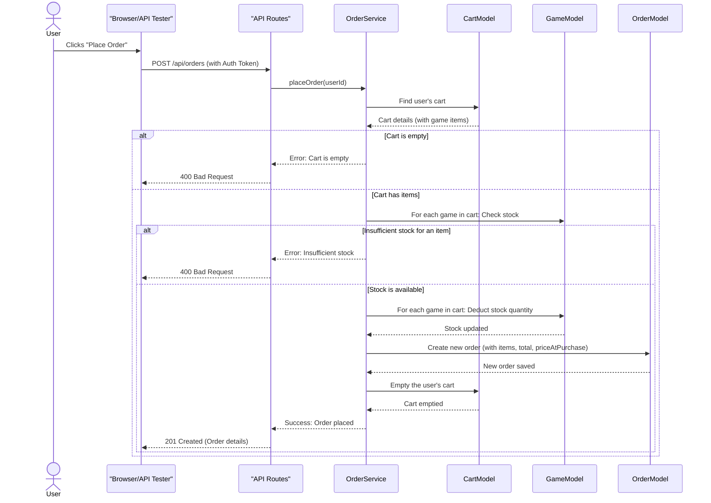

# GameHaven API

Welcome to GameHaven API! This is the backend system for an online game store. It's built using Node.js, Express, and MongoDB, and it allows users to register, browse games, manage a shopping cart, place orders, and leave reviews.

## Core Features

*   **User Accounts:** Secure registration and login for users.
*   **Role System:** Different access levels for regular users and administrators (e.g., admins can add games).
*   **Game Catalog:** Admins can add, update, and delete games. Users can browse and view game details.
*   **Image Handling:** Support for uploading game cover images and gallery pictures.
*   **Shopping Cart:** Users can add games to their cart, update quantities, and remove items.
*   **Ordering System:** Users can place orders from their cart. Stock is managed, and order history is kept.
*   **Game Reviews:** Logged-in users can write one review per game.

## Technology Stack

*   **Backend:** Node.js, Express.js
*   **Database:** MongoDB (with Mongoose ODM)
*   **Authentication:** JSON Web Tokens (JWT)
*   **Image Uploads:** Multer
*   **Input Validation:** express-validator
*   **API Documentation/Testing (Basic):** Static `public/index.html`

## Development Tooling

*   **Linting:** ESLint (JavaScript), Stylelint (CSS)
*   **Code Formatting:** Prettier
*   **Git Hooks:** Husky and lint-staged (for running linters/formatters before commits)
*   **Testing Framework:** Vitest (for automated tests)
*   **Environment Variables:** `dotenv` for managing configuration

## Visualizing the System

Here are a few diagrams to help understand the system's architecture and flow:

### 1. High-Level Architecture

This diagram shows how different parts of the system interact.



### 2. Simplified Data Model (Entities & Relationships)

This shows the main data pieces and how they connect.



### 3. Order Placement Flow

This sequence diagram shows the steps involved when a user places an order.



## Key Assumptions & Design Choices

During the development of this API, certain simplifying assumptions and design choices were made:

1.  **Price at Order Confirmation:** When a user places an order, the price of each game at that exact moment (`priceAtPurchase`) is stored with the order. This means if the game's price changes later in the shop, it won't affect past orders.
2.  **Immediate Stock Deduction:** When an order is successfully created, the stock quantity for the purchased games is reduced in the database immediately. This happens as part of a single transaction to ensure data consistency.
3.  **User Role Assignment:** For ease of testing and development, a user can specify their role (e.g., `user` or `admin`) during registration. In a real-world production system, admin roles would typically be assigned manually by an existing administrator through a separate, secure process. (See `FIX` comment in `./validators/authValidators.js`).
4.  **Local Image Storage:** Game cover images and gallery photos are stored directly on the server's file system in the `uploads/games/` directory. For a production environment, using a dedicated cloud storage service (like AWS S3, Cloudinary) would be more robust and scalable.
5.  **Single Review Per User Per Game:** A user can only review a specific game once. If they try to review the same game again, the system will prevent it.
6.  **JWT for Authentication:** User authentication is managed using JSON Web Tokens (JWTs). These tokens are sent by the client in the `Authorization` header for protected routes.
7.  **MongoDB Database:** The project is designed to work with a MongoDB database. Connection strings for development and testing (`MONGO_URI`, `MONGO_URI_TEST`) are expected in an `.env` file.

## Interactive API Tester (`public/index.html`)

The project includes a basic HTML page located at `public/index.html`. This page serves as a simple interactive tester for the API. You can use it to:

*   Register and log in users.
*   View a list of games.
*   Add games to your cart (as a logged-in user).
*   View your cart.
*   Place orders.
*   View your order history.
*   (Admin) Add and edit games.

This is very useful for quick, manual testing of the API endpoints directly from your browser without needing a separate tool like Postman for basic flows. Just run the server and open `http://localhost:PORT/` in your browser.

## Project Setup and Usage

### 1. Clone the Repository

```bash
git clone https://github.com/OlaRedaAbdulrazeq/GameHaven-API.git
cd GameHaven-API
```

### 2. Install Dependencies

```bash
npm install
```

### 3. Setup Environment Variables

*   Create a `.env` file in the root of the project.
*   Copy the contents from `.env.example` into your new `.env` file.
*   Fill in your actual `MONGO_URI` (for your MongoDB database), `MONGO_URI_TEST` (for your test database), and a strong `JWT_SECRET`.

Example `.env` file:
```
NODE_ENV=development
PORT=5000
MONGO_URI=your_mongodb_connection_string
MONGO_URI_TEST=your_mongodb_test_connection_string
JWT_SECRET=a_very_strong_and_long_secret_key_for_jwt!
JWT_EXPIRES_IN=30d
```

### 4. Run the Server

For development with automatic restarts on file changes (if you have `nodemon` installed globally or as a dev dependency and a script for it):
```bash
npm run dev
```
Otherwise, to just start the server:
```bash
npm start
```
The server will typically run on `http://localhost:5000` (or the `PORT` you specified).

### 5. Running Tests
To run the automated tests:
```bash
npm run test:run
```
Or for an interactive UI for tests:
```bash
npm run test:ui
```

## Project Architecture (File Structure)

```text
GameHaven-API/
├── .github/        # GitHub workflows & configurations
├── .husky/         # Git hooks for pre-commit, lint, etc.
├── config/         # App configuration (e.g., DB)
├── controllers/    # Express route controllers (handle requests, call services)
├── middleware/     # Custom middleware (e.g., auth, error handling, file uploads)
├── models/         # Mongoose schemas (define data structure)
├── node_modules/   # Dependencies (often omitted from READMEs for brevity)
├── public/         # Public assets (like index.html API tester)
├── routes/         # API route definitions (map URLs to controllers)
├── services/       # Business logic and database interactions
├── tests/          # Unit & integration tests
├── uploads/        # Uploaded image files (locally stored)
├── utils/          # Utility/helper functions (e.g., ApiError, ApiResponse)
├── validators/     # Validation rules using express-validator
├── .env            # Environment variables (not committed)
├── .env.example    # Example environment config
├── .gitignore      # Git ignore rules
├── .prettierrc.json # Prettier code style config
├── .stylelintrc.json # Stylelint code style config
├── app.js          # Express app initialization and main configuration
├── server.js       # Server entry point (starts the HTTP server)
├── eslint.config.mjs # ESLint configuration
├── package.json    # Project metadata and scripts
└── README.md       # This project documentation
```

## REST API Endpoints

(Refer to `routes/` directory for detailed implementation)

### Authentication (`/api/auth`)

*   `POST /register` — Register a new user.
*   `POST /login` — Login an existing user and receive a JWT.

### Games (`/api/games`)

*   `GET /` — List all available games. Supports filtering (e.g., `genre`, `platform`, `keyword`). Admin users see all games including out-of-stock.
*   `GET /:id` — Get details for a specific game by its ID.
*   `POST /` — (Admin Only) Add a new game (supports image uploads for cover/gallery).
*   `PUT /:id` — (Admin Only) Update an existing game by ID (supports image uploads).
*   `DELETE /:id` — (Admin Only) Delete a game by ID.

### Game Reviews (`/api/games/:gameId/reviews`)

*   `GET /` — Get all reviews for a specific game.
*   `POST /` — (User Only) Add a review for a specific game. A user can only review a game once.

### Shopping Cart (`/api/cart`)

(All cart routes require user authentication)
*   `GET /` — Get the current user's shopping cart.
*   `POST /` — Add a game to the cart or update quantity if it already exists.
    *   Body: `{ "gameId": "...", "quantity": ... }`
*   `PUT /:gameId` — Update the quantity of a specific game in the cart.
    *   Body: `{ "quantity": ... }`
*   `DELETE /` — Clear all items from the user's cart.
*   `DELETE /:gameId` — Remove a specific game item from the cart.

### Orders (`/api/orders`)

(All order routes require user authentication)
*   `POST /` — Place a new order using items currently in the user's cart. Cart will be emptied.
*   `GET /` — Get the order history for the logged-in user.
*   `GET /:id` — Get details for a specific order by its ID (must belong to the logged-in user).

